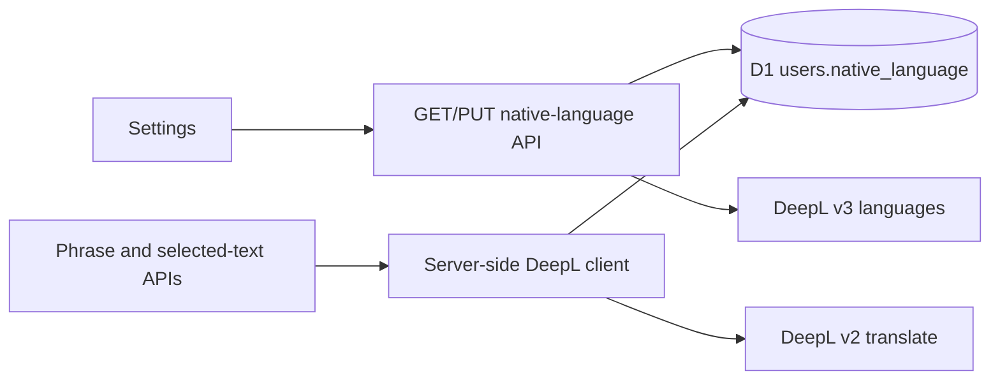

# Native language Settings design

## Architecture

Settings loads the account preference and target languages. PUT checks a fresh DeepL capability response before updating only the authenticated user's row. Translation reads that row and sends its code as `target_lang` with fixed `source_lang: EN`.

## Data and API

- `users.native_language TEXT NOT NULL DEFAULT 'ru'` is appended by migration `0026_native_language.sql`. The choice belongs to the account, not its API key.
- `GET /api/settings/native-language` returns `{ nativeLanguage, languages: [{ code, name }] }`; with no key, the list is empty and the choice remains visible.
- `PUT /api/settings/native-language` accepts `{ nativeLanguage }`, requires authentication and matching Origin, validates against stable `usable_as_target` entries from `GET /v3/languages?resource=translate_text`, and saves the canonical code.
- The server uses the personal encrypted key or the shared Worker key. Keys never enter the response. Guests translate to Russian.

## Decisions and trade-offs

- A static list would drift; the live DeepL API keeps options and server validation aligned but adds one provider call on page load and save.
- Browser storage would not follow an account across devices. A user column is the smallest durable option for one preference.
- A local React combobox avoids a new dependency and provides labelled search, listbox semantics, and keyboard selection.
- Existing saved translations, AI Chat explanations, and Tatoeba data remain outside this DeepL-specific change.

## Reliability and security

Responses use no-store. DeepL calls retain the existing 8-second timeout and server-only key resolution. PUT validates Origin, request size, payload type, and supported code. Provider failure leaves the choice unchanged. The migration must precede deployment; old code tolerates the extra column.
