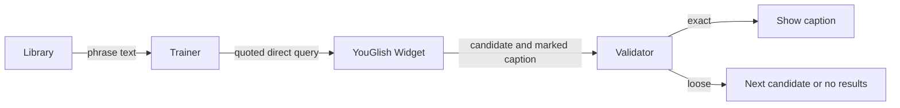

# Exact YouGlish Phrase Search Design

## Architecture Overview

Library already passes the whole `phrase.text` in the trainer URL. The trainer owns provider query construction and caption rendering.

## Data Models and API Design

No application API or storage changes. All mode sends the phrase in double quotes and omits `:r`. Saved clips keep `query #videoId`; Full Video Mode keeps `restoreQuery #videoId`.

## Component Breakdown

- `fetchPhrase` sends the quoted direct query in YouGlish All mode.
- `onCaptionChange` compares normalized, case-insensitive caption text against the complete selected phrase, including punctuation and word boundaries. Provider `[[[...]]]` markers trigger rejection of a loose candidate.
- Per-video state prevents repeated `next()` calls on duplicate callbacks. The final rejected candidate pauses and shows no-exact-results feedback.
- Tatoeba remains randomized. Saved clips and Full Video Mode bypass this All-mode validation.

## Design Decisions

- Live YouGlish comparison showed `:r` could surface loose matches; quotes narrowed the candidate set. Both changes are needed to select useful candidates.
- Local validation handles occasional imperfect provider candidates. It waits for a marked caption before rejecting, so unmatched pre-roll captions are not treated as proof of failure.
- Validation is limited to multiword All-mode searches. Single-word quoted searches use the provider's own result behavior.

## Non-Functional Requirements

No extra network request or dependency. At most one `next()` is issued per rejected video. Results depend on provider caption availability and timing.
